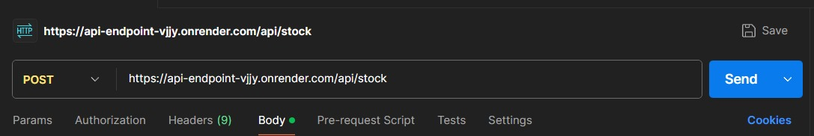
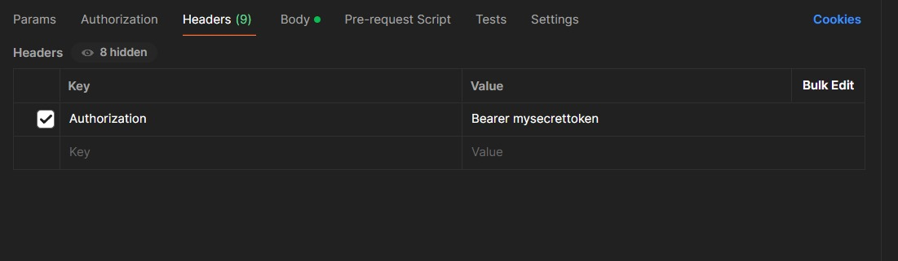
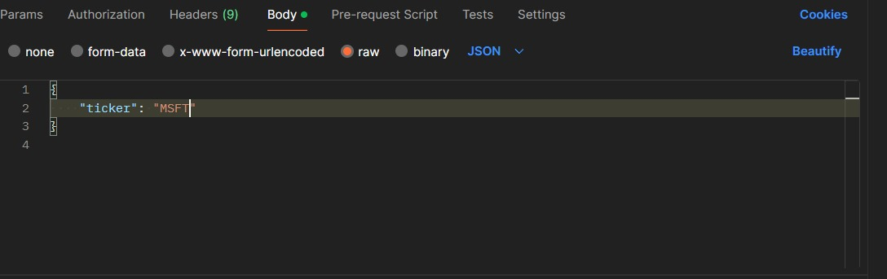
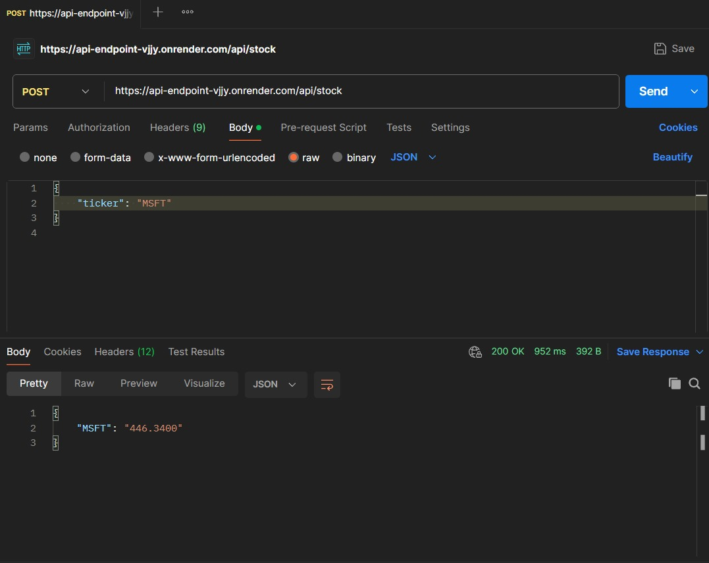

#Content
**The contents of the application are in the app.py**
**The contents of the unittest are in the tests.py script**
**The contents of the configuration i.e. API KEY are in the config.py script**

# Stock Price API Usage Guide for Postman

This document provides details on how to use the Stock Price API hosted at `https://api-endpoint-vjjy.onrender.com/api/stock` using Postman.

## API Endpoint

### `/api/stock`

**Method:** `POST`

**Description:** Retrieves the current stock price for a given ticker symbol.

**Headers:**
- `Authorization`: Bearer token required for authentication. The token value must be `mysecrettoken`.

**Request Body (JSON):**
- `ticker`: The ticker symbol of the stock (string).

## Using Postman

To use the API in Postman, follow these steps:

### Step 1: Create a New Request

1. Open Postman.
2. Click on **New** and select **Request**.

### Step 2: Set Up the Request

1. **Enter the Request URL:**
   ```
   https://api-endpoint-vjjy.onrender.com/api/stock
   ```


2. **Select the Request Method:**
   - Set the method to `POST`.
   


3. **Add Headers:**
   - Key: `Authorization`
   - Value: `Bearer mysecrettoken`

   Ensure you add a space between `Bearer` and `mysecrettoken`.
   


4. **Set the Request Body:**
   - Select the **Body** tab.
   - Choose **raw** and set the format to **JSON**.
   - Enter the JSON body. For example:
     ```json
     {
         "ticker": "MSFT"
     }
     ```



### Step 3: Send the Request

1. Click the **Send** button to make the request.

### Step 4: View the Response

1. The response will appear in the lower section of the Postman window. It should look like this for a successful request:
   ```json
   {
       "MSFT": "150.00"
   }
   ```


## Example Requests

### Example 1: Fetch Stock Price for Apple Inc. (AAPL)

**Request Body:**
```json
{
    "ticker": "AAPL"
}
```

**Expected Response:**
```json
{
    "AAPL": "150.00"
}
```

### Example 2: Fetch Stock Price for Microsoft Corporation (MSFT)

**Request Body:**
```json
{
    "ticker": "MSFT"
}
```

**Expected Response:**
```json
{
    "MSFT": "280.50"
}
```

### Example 3: Fetch Stock Price for Tesla Inc. (TSLA)

**Request Body:**
```json
{
    "ticker": "TSLA"
}
```

**Expected Response:**
```json
{
    "TSLA": "650.30"
}
```

## Error Handling

The API provides clear error messages for various error conditions. Here are some examples:

### Example: Missing Authorization Header

**Request Body:**
```json
{
    "ticker": "AAPL"
}
```

**Response:**
```json
{
    "error": "Unauthorized"
}
```

### Example: Incorrect Ticker Format

**Request Body:**
```json
{
    "ticker": 12345
}
```

**Response:**
```json
{
    "error": "Ticker symbol is required and must be a string"
}
```

### Example: Stock Data Not Found

**Request Body:**
```json
{
    "ticker": "UNKNOWN"
}
```

**Response:**
```json
{
    "error": "Stock data not found"
}
```

# Stock Price API Unit Tests

## Test Cases

### 1. Unauthorized Access

- **Scenario:** Attempt to access the API without an `Authorization` header or with an incorrect token.
- **Expected Response:** 401 Unauthorized
- **Response Body:**
  ```json
  {
      "error": "Unauthorized"
  }
  ```

### 2. Missing Ticker Symbol

- **Scenario:** Attempt to fetch stock price without providing a ticker symbol.
- **Expected Response:** 400 Bad Request
- **Response Body:**
  ```json
  {
      "error": "Ticker symbol is required and must be a string"
  }
  ```

### 3. Ticker Symbol Not a String

- **Scenario:** Provide a ticker symbol that is not a string.
- **Expected Response:** 400 Bad Request
- **Response Body:**
  ```json
  {
      "error": "Ticker symbol is required and must be a string"
  }
  ```

### 4. Successful Stock Price Retrieval

- **Scenario:** Successfully fetch the stock price for a valid ticker symbol.
- **Expected Response:** 200 OK
- **Response Body:**
  ```json
  {
      "AAPL": "189.05"
  }
  ```

### 5. Failed Stock Price Fetch

- **Scenario:** External API request fails.
- **Expected Response:** 500 Internal Server Error
- **Response Body:**
  ```json
  {
      "error": "Failed to fetch stock price"
  }
  ```

### 6. Stock Data Not Found

- **Scenario:** External API returns no data for the given ticker symbol.
- **Expected Response:** 404 Not Found
- **Response Body:**
  ```json
  {
      "error": "Stock data not found"
  }
  ```

### 7. Stock Price Not Available

- **Scenario:** External API returns data but the stock price is missing.
- **Expected Response:** 404 Not Found
- **Response Body:**
  ```json
  {
      "error": "Stock price not available"
  }
  ```

## Running the Tests

To run the tests, ensure you have `unittest` installed and execute the following command:

```sh
python -m unittest test.py
```

These unit tests ensure that the Stock Price API is robust and handles various edge cases gracefully.

# Stock Price API

This application is a Flask-based web service that retrieves the current stock price for a given ticker symbol using the Alpha Vantage API. The application ensures secure access and proper request validation.

## Problem Statement

The goal of this application is to provide an easy and secure way to fetch real-time stock prices. Users can request the price of a specific stock by providing its ticker symbol. The application ensures the request is authenticated and handles errors gracefully, providing clear feedback on any issues encountered.

## API Endpoint

### `/api/stock`

**Method:** `POST`

**Description:** Retrieves the current stock price for a given ticker symbol.


## Installation and Setup

1. **Clone the repository:**
   ```sh
   git clone https://github.com/satvikaryan/api_endpoint
   cd api_endpoint
   ```

2. **Create a virtual environment:**
   ```sh
   python3 -m venv venv
   source venv/bin/activate
   ```

3. **Install dependencies:**
   ```sh
   pip install -r requirements.txt
   ```

4. **Create a `config.py` file with your Alpha Vantage API key:**
   ```python
   # config.py
   API_KEY = 'your_alpha_vantage_api_key'
   ```

5. **Run the application:**
   ```sh
   flask run
   ```

## Usage Example

To fetch the stock price of a company with the ticker symbol "AAPL":

```sh
curl -X POST http://127.0.0.1:5000/api/stock \
-H "Content-Type: application/json" \
-H "Authorization: Bearer mysecrettoken" \
-d '{"ticker": "AAPL"}'
```

The response will be:

```json
{
    "AAPL": "150.00"
}
```

## Error Handling

The application includes robust error handling to ensure that users receive meaningful messages for various error conditions, such as missing authorization, incorrect request format, or issues with the external API.

